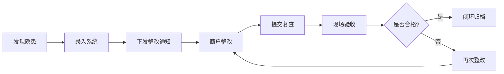

## 1. 产品概述

大型商场公共安全值守Web系统，面向商场安保部、物业工程部和属地监管人员，实现商场安全运营的数字化、智能化管理。通过统一平台整合值班调度、巡更管理、事件处置、客流监测、设施巡检、商户管理、应急演练等核心业务，提升商场安全管理效率和应急响应能力。

## 2. 核心功能

### 2.1 用户角色

| 角色 | 注册方式 | 核心权限 |
|------|----------|----------|
| 安保部人员 | 系统管理员分配 | 值班管理、巡更打卡、事件处置、客流查看、应急响应 |
| 物业工程人员 | 系统管理员分配 | 设施检查、设备报修、整改跟踪、维保记录 |
| 属地监管人员 | 系统管理员分配 | 数据查看、报表统计、整改监督、演练评估 |
| 系统管理员 | 系统初始化 | 用户管理、权限配置、系统设置 |

### 2.2 功能模块

1. **值班看板**：班次信息、在岗人员、实时告警、待办事项
2. **巡更路线**：路线配置、打卡记录、巡更统计、异常预警
3. **事件处置**：事件上报、分级处理、进度跟踪、结案归档
4. **客流预警**：实时客流、热力分布、拥堵预警、历史分析
5. **设施检查**：扶梯停运登记、玻璃护栏检查、设备巡检记录
6. **商户整改**：消防通道检查、整改通知、整改跟踪、验收记录
7. **应急演练**：演练计划、演练记录、复盘纪要、效果评估
8. **经营报表**：绩效统计、安全指标、月度报告、数据导出

### 2.3 页面详情

| 页面名称 | 模块名称 | 功能描述 |
|----------|----------|----------|
| 值班看板 | 班次交接 | 交接班记录、工作事项移交、签字确认 |
| 值班看板 | 在岗状态 | 人员在岗情况、实时位置、联系信息 |
| 值班看板 | 实时告警 | 未处理事件、预警信息、一键处置 |
| 巡更路线 | 路线管理 | 巡更点配置、路线规划、时间设置 |
| 巡更路线 | 打卡记录 | NFC/二维码打卡、漏检提醒、轨迹回放 |
| 事件处置 | 事件上报 | 失物招领、走失人员、拥堵点上报、现场图片 |
| 事件处置 | 分级处理 | 突发事件分级、广播联动记录、多部门协同 |
| 客流预警 | 实时监测 | 区域客流、热力图、拥堵点识别 |
| 客流预警 | 阈值预警 | 客流超限告警、疏散建议、历史趋势 |
| 设施检查 | 设备巡检 | 扶梯停运登记、玻璃护栏检查、设备状态 |
| 设施检查 | 报修跟踪 | 保修申请、维修进度、验收闭环 |
| 商户整改 | 检查记录 | 消防通道检查、安全隐患记录、现场拍照 |
| 商户整改 | 整改管理 | 整改通知下发、整改期限、复查验收 |
| 应急演练 | 演练计划 | 演练方案、参与人员、时间安排 |
| 应急演练 | 复盘纪要 | 演练记录、问题总结、改进措施 |
| 经营报表 | 绩效统计 | 人员绩效、事件处理时效、整改完成率 |
| 经营报表 | 数据导出 | 月度报表、年度报告、多格式导出 |
| 通知公告 | 公告管理 | 通知发布、已读回执、紧急广播 |
| 应急联系人 | 通讯录 | 内部联系人、外部应急机构、一键拨打 |

## 3. 核心流程

### 3.1 事件处置流程

安保人员发现安全事件后，通过系统上报事件信息（包含现场图片），系统根据事件类型自动分级，分派给对应部门处理。处理过程中记录每一步操作，处理完成后结案归档，相关数据纳入绩效统计。

### 3.2 巡更管理流程

管理员配置巡更路线和打卡点，安保人员按规定时间和路线巡更，通过NFC或二维码打卡。系统实时记录巡更轨迹，对漏检、超时等异常情况发出预警。

### 3.3 商户整改流程

检查人员发现商户安全隐患后，录入系统并生成整改通知，商户在规定期限内完成整改并提交复查申请，检查人员现场验收后闭环流程。

## 4. 用户界面设计

### 4.1 设计风格

- **主色调**：深蓝色系（#1e3a5f）作为主色，代表专业、可靠、安全
- **辅助色**：橙色（#f59e0b）用于告警和强调，绿色（#10b981）表示正常，红色（#ef4444）表示紧急
- **按钮风格**：圆角矩形，微悬浮效果，点击反馈
- **字体**：中文使用"PingFang SC"、"Microsoft YaHei"，数字和英文使用"Roboto Mono"
- **布局风格**：侧边栏导航 + 顶部状态栏 + 卡片式内容区，支持深色模式
- **图标风格**：线性图标为主，关键操作使用填充图标，保持一致的2px线条宽度

### 4.2 页面设计概览

| 页面名称 | 模块名称 | UI元素 |
|----------|----------|--------|
| 值班看板 | 概览区 | 数据卡片、告警列表、人员状态表格 |
| 值班看板 | 实时监控 | 大屏布局、客流热力图、事件滚动列表 |
| 巡更路线 | 路线地图 | 地图组件、巡更点标记、轨迹连线 |
| 事件处置 | 事件列表 | 标签页分类、状态标签、筛选器、时间轴 |
| 客流预警 | 数据可视化 | 折线图、柱状图、热力图、预警指示器 |
| 设施检查 | 检查表单 | 分步表单、图片上传、签名确认 |
| 经营报表 | 统计图表 | 仪表盘、饼图、趋势图、导出按钮 |

### 4.3 响应式设计

- 采用桌面优先设计，适配1920×1080及以上分辨率
- 侧边栏在平板设备可折叠收起
- 数据表格在小屏幕支持横向滚动
- 关键操作按钮在移动端优化触控区域

### 4.4 动效设计

- 页面切换采用淡入淡出过渡（200ms）
- 数据加载采用骨架屏占位
- 告警信息采用脉冲动画吸引注意
- 卡片悬停有轻微上浮和阴影加深效果
- 表单验证错误有抖动反馈
