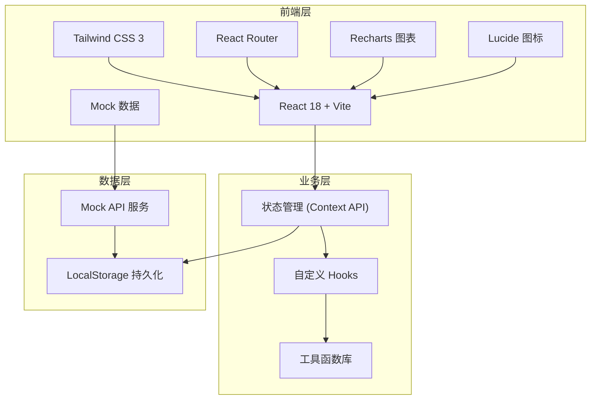
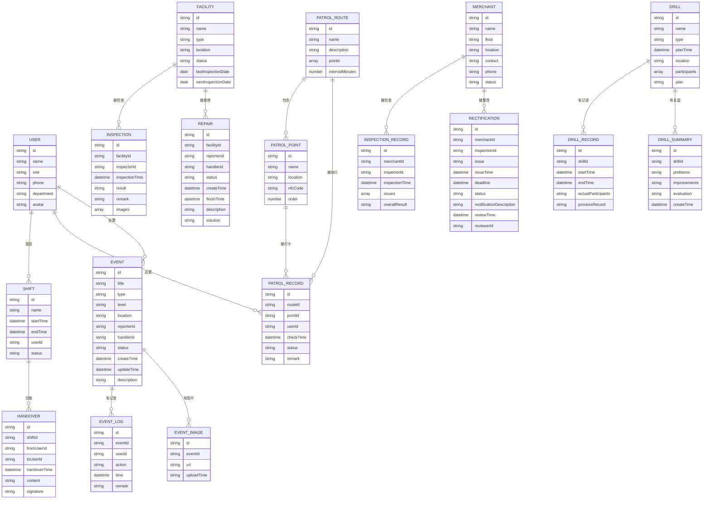

## 1. 架构设计



## 2. 技术选型说明

- **前端框架**: React@18 + TypeScript
- **构建工具**: Vite@5
- **样式方案**: TailwindCSS@3
- **路由管理**: React Router@6
- **图表库**: Recharts@2
- **图标库**: Lucide React
- **状态管理**: React Context API + useReducer
- **数据模拟**: Mock 数据 + LocalStorage
- **日期处理**: date-fns

## 3. 路由定义

| 路由路径 | 页面名称 | 说明 |
|----------|----------|------|
| /dashboard | 值班看板 | 系统首页，展示核心数据概览 |
| /patrol | 巡更路线 | 巡更路线管理和打卡记录 |
| /events | 事件处置 | 安全事件列表和处理流程 |
| /crowd | 客流预警 | 客流监测和预警分析 |
| /facility | 设施检查 | 设备巡检和维修管理 |
| /merchant | 商户整改 | 商户检查和整改跟踪 |
| /drill | 应急演练 | 演练计划和复盘记录 |
| /reports | 经营报表 | 数据统计和报表导出 |
| /notices | 通知公告 | 系统通知和公告管理 |
| /contacts | 应急联系人 | 通讯录和紧急联系方式 |

## 4. 核心数据模型

### 4.1 数据模型定义



### 4.2 目录结构

```
src/
├── assets/           # 静态资源
├── components/       # 公共组件
│   ├── layout/      # 布局组件
│   ├── ui/          # 基础UI组件
│   └── charts/      # 图表组件
├── pages/           # 页面组件
│   ├── Dashboard/
│   ├── Patrol/
│   ├── Events/
│   ├── Crowd/
│   ├── Facility/
│   ├── Merchant/
│   ├── Drill/
│   ├── Reports/
│   ├── Notices/
│   └── Contacts/
├── hooks/           # 自定义Hooks
├── context/         # Context状态管理
├── types/           # TypeScript类型定义
├── utils/           # 工具函数
├── mock/            # Mock数据
├── App.tsx
├── main.tsx
└── index.css
```

## 5. 核心功能模块实现方案

### 5.1 值班看板
- 顶部展示当前班次信息、在岗人员数量、待处理事件数等核心指标卡片
- 左侧展示实时事件列表，支持按状态筛选
- 右侧展示人员在岗状态表格和客流趋势图
- 底部展示最新通知公告滚动条

### 5.2 巡更路线
- 左侧路线列表，支持新建、编辑、删除路线
- 右侧展示选中路线的详细信息和打卡点地图
- 打卡记录表格，支持按时间、人员筛选
- 异常巡更记录高亮显示

### 5.3 事件处置
- 标签页分类展示：全部、待处理、处理中、已结案
- 事件卡片展示：事件标题、等级、位置、上报时间、状态
- 点击事件卡片进入详情页，展示处理时间轴和现场图片
- 支持事件上报、分派、处理、结案全流程操作

### 5.4 客流预警
- 顶部客流总览卡片：实时客流、今日峰值、拥堵区域数
- 区域客流热力图
- 客流趋势折线图（24小时/7天可选）
- 拥堵预警列表，支持一键处置

### 5.5 设施检查
- 左侧设施分类导航：扶梯、玻璃护栏、消防设备等
- 中间设施列表，支持状态筛选
- 右侧设施详情和检查记录
- 扶梯停运登记表单，支持图片上传

### 5.6 商户整改
- 商户列表，支持按楼层、状态筛选
- 检查记录表，展示历次检查情况
- 整改通知书模板，支持一键生成和下发
- 整改进度时间轴展示

### 5.7 应急演练
- 演练计划日历视图
- 演练方案详情页
- 演练记录和复盘纪要表单
- 演练效果评估雷达图

### 5.8 经营报表
- 核心指标仪表盘
- 多维度统计图表（按时间、部门、类型）
- 人员绩效排行榜
- 报表导出功能（Excel/PDF）
